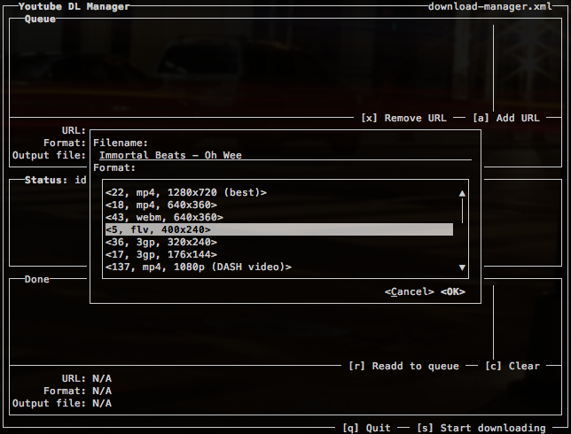
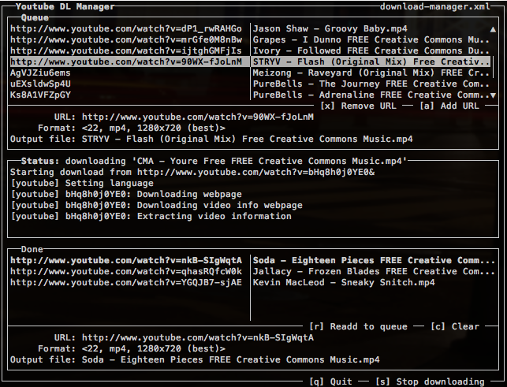

youtube-dl-manager
==================

Extension of [youtube-dl][youtube-dl] with TUI and more functionality. 

## Requirements

The application requires **Python 3.3.3** or higher with **unicode curses** support. See also [this note][python-curses-support].

 [youtube-dl]: https://github.com/rg3/youtube-dl
 [python-curses-support]: https://github.com/hverr/installing-debian-home-server/blob/master/development-environment/python3-and-development.md#curses-support
 
## Bugs
Known bugs:

 - Drawing of modal screens (like the add, quit, etc. screen) isn't done properly when updating the status box while downloading media.
 
## To-do
- Support post-processing of media like `ffmpeg` conversions
 
## Screnshots

### Adding an item to the download queue

 
### Downloading the media

